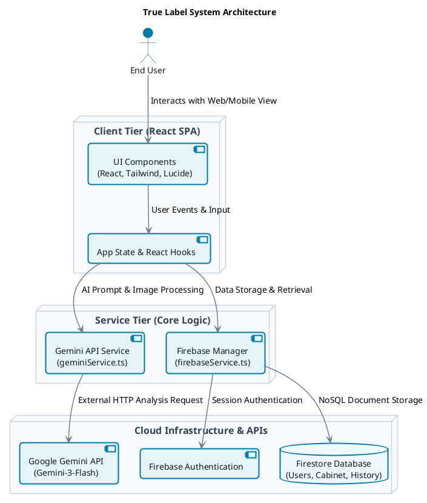

<div align="center">


# True Label

**Your Intelligent, Personalized Food and Medicine Safety Companion**
</div>

## 📌 Overview
True Label is a highly personalized Web Application designed to analyze product labels (food and medicine) against a user's specific health profile. By mapping allergies, chronic illnesses, medications, and health goals, it automatically determines safety ratings and checks for dangerous drug-food or drug-drug interactions.

## ✨ Core Features
- **Personalized Safety Scanning**: Upload product labels to get an instant safety report (Green/Yellow/Red) tailored exclusively to your health profile.
- **Health Cabinet**: Digitally manage your household food and medicine inventory.
- **Interaction Checker**: Automatically cross-reference new scanned items against your cabinet inventory for dangerous interactions.
- **AI Health Assistant**: Ask questions and get context-aware answers in English, Hindi, or Telugu.

## 🛠️ Technology Stack
- **Frontend**: React (Vite), TypeScript, Tailwind CSS, Lucide Icons
- **Backend / BaaS**: Firebase (Authentication & Firestore)
- **Intelligence**: Google Gemini (gemini-3-flash API)

## 🚀 Run Locally

**Prerequisites:** Node.js (v18+)

1. Clone the repository and navigate to the project directory.
2. Install the necessary dependencies:
   ```bash
   npm install
   ```
3. Set up the environment variables:
   - Create a `.env` or `.env.local` file in the root directory.
   - Add your Gemini API key and Firebase configurations (refer to `.env.example` if available):
     ```env
     GEMINI_API_KEY=your_gemini_api_key_here
     ```
4. Run the development server:
   ```bash
   npm run dev
   ```

## 📐 System Architecture

Below is the PlantUML Architecture Diagram detailing how the components of True Label interact in a strict Top-Down hierarchical flow:



